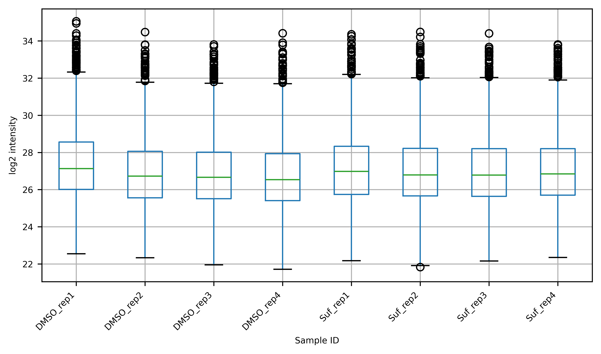
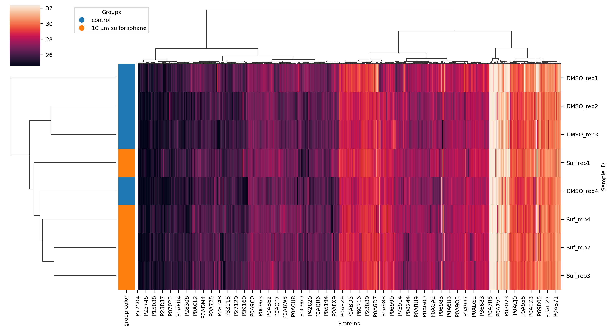
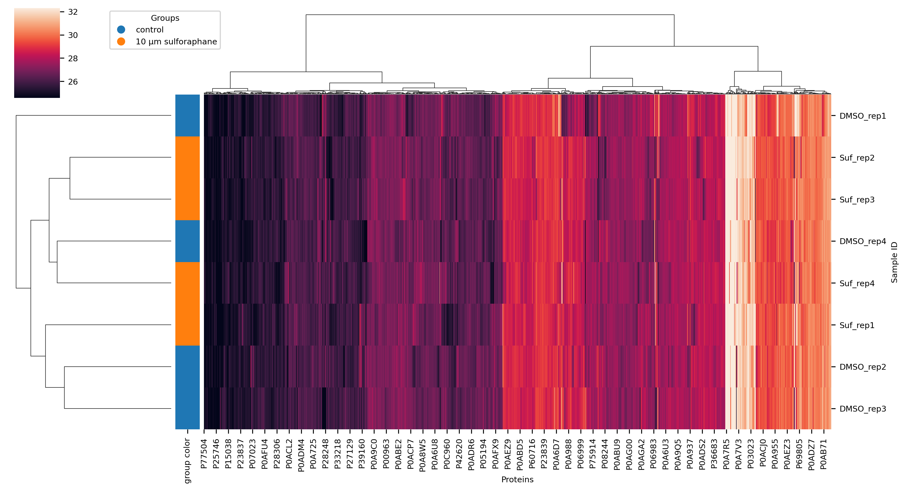
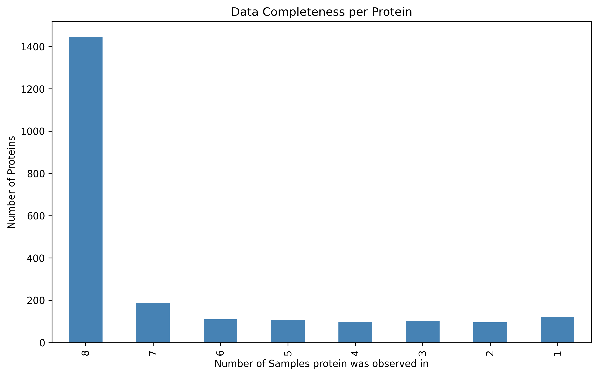
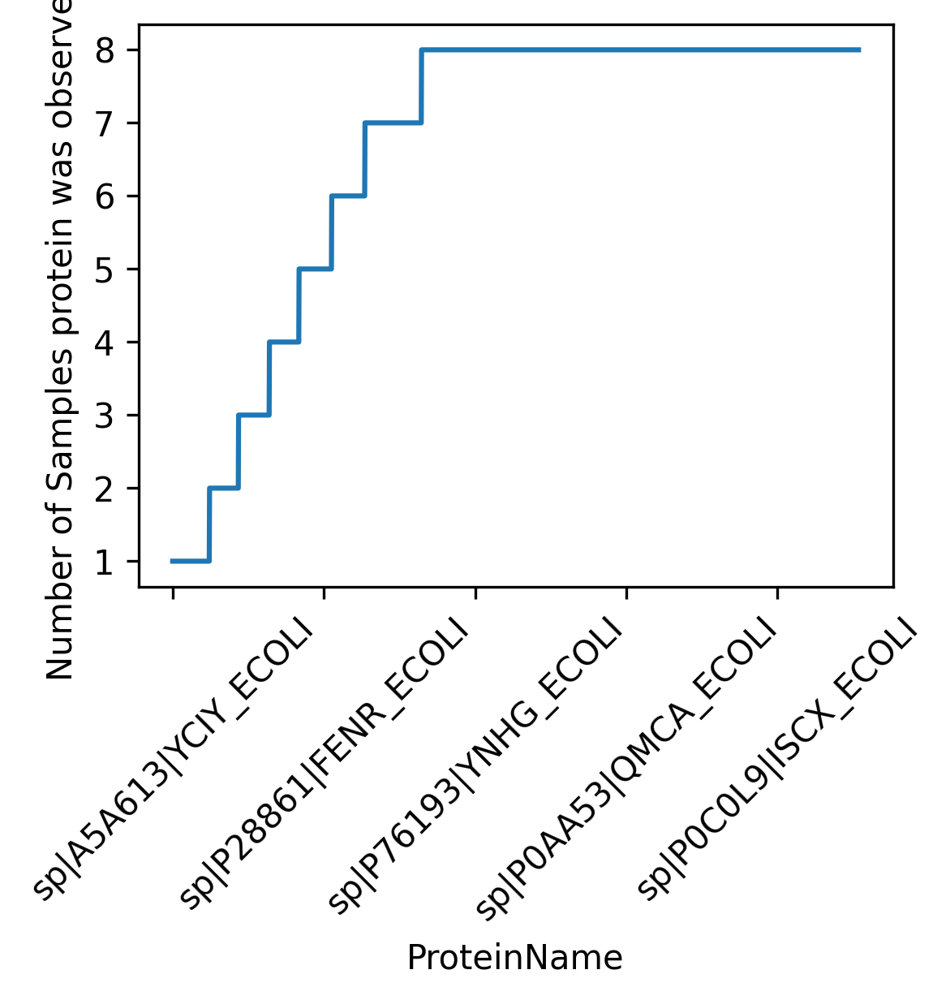
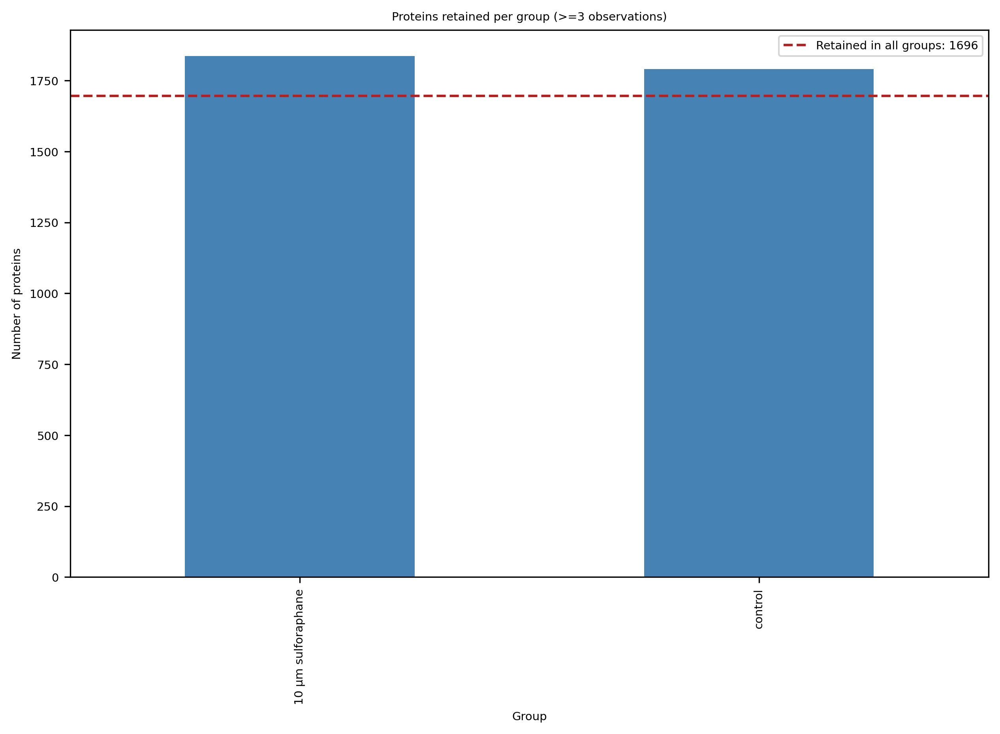

```{python}
#| label: 'Imports'
from itables import show, init_notebook_mode
from pathlib import Path
import json
import pandas as pd
import plotly.io as pio
import requests


init_notebook_mode(all_interactive=True)
report_dir = Path().cwd()
```

Example report for the DSP course proteomics introduction based on the data from PXD040621.
# Data
Check the sample quality.

## Clustermap
### Boxplot Log2 Unnormalized
{fig-alt= width=90%}

### Clustermap Ward
{fig-alt= width=90%}

### Clustermap Ward Median
{fig-alt= width=90%}

### Cv Vs Mean

```{python}
#| label: 'Cv Vs Mean 4'
#| fig-cap: ""

with open(report_dir /'../report/1_data/clustermap/cv_vs_mean.json', 'r') as plot_file:
    plot_json = json.load(plot_file)

# Keep only 'data' and 'layout' sections
plot_json = {key: plot_json[key] for key in plot_json
                if key in ['data', 'layout']
            }
# Remove 'frame' section in 'data'
plot_json['data'] = [{k: v for k, v in entry.items() if k != 'frame'}
                            for entry in plot_json.get('data', [])
                    ]
# Convert JSON to string
plot_json_str = json.dumps(plot_json)
# Create the plotly plot
fig_plotly = pio.from_json(plot_json_str)
fig_plotly.update_layout(autosize=False, width=950, height=400,
                         margin=dict(b=50, t=50, l=50, r=50)
                         )

fig_plotly.show()
```

## Completeness
### Data Completeness Bar Plot
{fig-alt= width=90%}

### Data Completeness Step Plot
{fig-alt= width=90%}

### Proteins
```{python}
#| label: 'Proteins 1'
#| fig-cap: ""

df = pd.read_csv(report_dir / '../report/1_data/completeness/proteins.csv')

show(df, classes="display nowrap compact", lengthMenu=[3, 5, 10])
```

### Proteins Identifiers
```{python}
#| label: 'Proteins Identifiers 2'
#| fig-cap: ""

df = pd.read_csv(report_dir / '../report/1_data/completeness/proteins_identifiers.csv')

show(df, classes="display nowrap compact", lengthMenu=[3, 5, 10])
```

# Differential Regulation
Find differently expressed proteins between the control and the 10 µm sulforaphane condition.

## Overview Differential Regulation
### Volcano Plot

```{python}
#| label: 'Volcano Plot 7'
#| fig-cap: ""

with open(report_dir /'../report/2_differential_regulation/0_volcano_plot.json', 'r') as plot_file:
    plot_json = json.load(plot_file)

# Keep only 'data' and 'layout' sections
plot_json = {key: plot_json[key] for key in plot_json
                if key in ['data', 'layout']
            }
# Remove 'frame' section in 'data'
plot_json['data'] = [{k: v for k, v in entry.items() if k != 'frame'}
                            for entry in plot_json.get('data', [])
                    ]
# Convert JSON to string
plot_json_str = json.dumps(plot_json)
# Create the plotly plot
fig_plotly = pio.from_json(plot_json_str)
fig_plotly.update_layout(autosize=False, width=950, height=400,
                         margin=dict(b=50, t=50, l=50, r=50)
                         )

fig_plotly.show()
```

### Differential Regulation
```{python}
#| label: 'Differential Regulation 3'
#| fig-cap: ""

df = pd.read_csv(report_dir / '../report/2_differential_regulation/1_differential_regulation.csv')

show(df, classes="display nowrap compact", lengthMenu=[3, 5, 10])
```

### Differently Regulated As In Paper
```{python}
#| label: 'Differently Regulated As In Paper 4'
#| fig-cap: ""

df = pd.read_csv(report_dir / '../report/2_differential_regulation/1_differently_regulated_as_in_paper.csv')

show(df, classes="display nowrap compact", lengthMenu=[3, 5, 10])
```

### Highlighted Proteins In Figure3
```{python}
#| label: 'Highlighted Proteins In Figure3 5'
#| fig-cap: ""

df = pd.read_csv(report_dir / '../report/2_differential_regulation/2_highlighted_proteins_in_figure3.csv')

show(df, classes="display nowrap compact", lengthMenu=[3, 5, 10])
```

### Data Completeness Per Group Median
{fig-alt= width=90%}

# Maltose Uptake
Analyze the maltose uptake pathway.

## Overview Maltose Uptake
### Volcano Plot

```{python}
#| label: 'Volcano Plot 9'
#| fig-cap: ""

with open(report_dir /'../report/3_maltose_uptake/0_volcano_plot.json', 'r') as plot_file:
    plot_json = json.load(plot_file)

# Keep only 'data' and 'layout' sections
plot_json = {key: plot_json[key] for key in plot_json
                if key in ['data', 'layout']
            }
# Remove 'frame' section in 'data'
plot_json['data'] = [{k: v for k, v in entry.items() if k != 'frame'}
                            for entry in plot_json.get('data', [])
                    ]
# Convert JSON to string
plot_json_str = json.dumps(plot_json)
# Create the plotly plot
fig_plotly = pio.from_json(plot_json_str)
fig_plotly.update_layout(autosize=False, width=950, height=400,
                         margin=dict(b=50, t=50, l=50, r=50)
                         )

fig_plotly.show()
```

### Differential Regulation
```{python}
#| label: 'Differential Regulation 6'
#| fig-cap: ""

df = pd.read_csv(report_dir / '../report/3_maltose_uptake/1_differential_regulation.csv')

show(df, classes="display nowrap compact", lengthMenu=[3, 5, 10])
```

### Differently Regulated As In Paper
```{python}
#| label: 'Differently Regulated As In Paper 7'
#| fig-cap: ""

df = pd.read_csv(report_dir / '../report/3_maltose_uptake/1_differently_regulated_as_in_paper.csv')

show(df, classes="display nowrap compact", lengthMenu=[3, 5, 10])
```

### Highlighted Proteins In Figure3
```{python}
#| label: 'Highlighted Proteins In Figure3 8'
#| fig-cap: ""

df = pd.read_csv(report_dir / '../report/3_maltose_uptake/2_highlighted_proteins_in_figure3.csv')

show(df, classes="display nowrap compact", lengthMenu=[3, 5, 10])
```

### Highlighted Proteins In Figure3 Intensities
```{python}
#| label: 'Highlighted Proteins In Figure3 Intensities 9'
#| fig-cap: ""

df = pd.read_csv(report_dir / '../report/3_maltose_uptake/3_highlighted_proteins_in_figure3_intensities.csv')

show(df, classes="display nowrap compact", lengthMenu=[3, 5, 10])
```

# Uniprot Annotations
## Overview Uniprot Annotations
### Differently Regulated As In Paper
```{python}
#| label: 'Differently Regulated As In Paper 10'
#| fig-cap: ""

df = pd.read_csv(report_dir / '../report/uniprot_annotations/1_differently_regulated_as_in_paper.csv')

show(df, classes="display nowrap compact", lengthMenu=[3, 5, 10])
```

### Highlighted Proteins In Figure3
```{python}
#| label: 'Highlighted Proteins In Figure3 11'
#| fig-cap: ""

df = pd.read_csv(report_dir / '../report/uniprot_annotations/2_highlighted_proteins_in_figure3.csv')

show(df, classes="display nowrap compact", lengthMenu=[3, 5, 10])
```

### Highlighted Proteins In Figure3 Intensities
```{python}
#| label: 'Highlighted Proteins In Figure3 Intensities 12'
#| fig-cap: ""

df = pd.read_csv(report_dir / '../report/uniprot_annotations/3_highlighted_proteins_in_figure3_intensities.csv')

show(df, classes="display nowrap compact", lengthMenu=[3, 5, 10])
```

### Highlighted Proteins In Figure3 Intensities Normalized
```{python}
#| label: 'Highlighted Proteins In Figure3 Intensities Normalized 13'
#| fig-cap: ""

df = pd.read_csv(report_dir / '../report/uniprot_annotations/3_highlighted_proteins_in_figure3_intensities_normalized.csv')

show(df, classes="display nowrap compact", lengthMenu=[3, 5, 10])
```

### Annotations
```{python}
#| label: 'Annotations 14'
#| fig-cap: ""

df = pd.read_csv(report_dir / '../report/uniprot_annotations/annotations.csv')

show(df, classes="display nowrap compact", lengthMenu=[3, 5, 10])
```

### Enrichment Analysis

```{python}
#| label: 'Enrichment Analysis 10'
#| fig-cap: ""

with open(report_dir /'../report/uniprot_annotations/enrichment_analysis.json', 'r') as plot_file:
    plot_json = json.load(plot_file)

# Keep only 'data' and 'layout' sections
plot_json = {key: plot_json[key] for key in plot_json
                if key in ['data', 'layout']
            }
# Remove 'frame' section in 'data'
plot_json['data'] = [{k: v for k, v in entry.items() if k != 'frame'}
                            for entry in plot_json.get('data', [])
                    ]
# Convert JSON to string
plot_json_str = json.dumps(plot_json)
# Create the plotly plot
fig_plotly = pio.from_json(plot_json_str)
fig_plotly.update_layout(autosize=False, width=950, height=400,
                         margin=dict(b=50, t=50, l=50, r=50)
                         )

fig_plotly.show()
```
